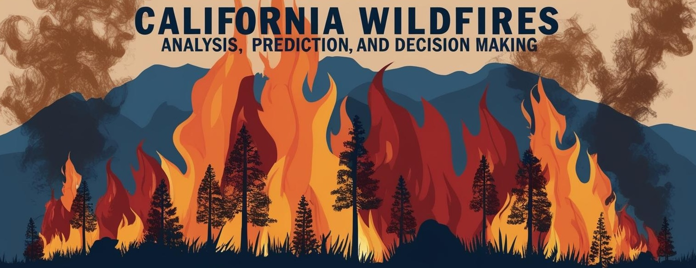

# 🔥 Wildfires Data Visualization Dashboard



A full-stack web application for exploring, forecasting, and planning wildfire response across California. Built with React.js, Node.js, D3.js, and Chart.js, this tool transforms complex incident data into meaningful visual insights for both analysts and the public.

---

## Key Features

- ** Exploratory Data Analysis (EDA Tab)**  
  Interactive charts and maps to analyze historical wildfire trends by county, year, and damage type.

- ** Prediction Tab**  
  Time-series forecasting of monthly incident counts, severity distribution visualizations, and hotspot projections.

- ** Decision Support Tab**  
  Real-time map tools, evacuation checklists, and safety resources for landowners and responders.

- ** User-Centric Design**  
  Dark mode, responsive layout, colorblind-safe palettes, and easy navigation between tabs.

---

## 🛠 Tech Stack

| Layer         | Technology                |
| ------------- | ------------------------- |
| Frontend      | React.js, Chart.js, D3.js |
| Backend       | Node.js, Express.js       |
| Data          | CSV, GeoJSON              |
| Visual Tools  | Line charts, heatmaps, KPIs, radar charts |
| Hosting       | Ready for deployment      |

---

## 🔗 Key Links

- [Project Survey (Google Form)](https://docs.google.com/forms/d/e/1FAIpQLSduARsKZC8DOXMLMi8ffVa16p6f89Ks97iOWLmyyT95iHnZXQ/viewform)
- [Wildfire Dataset Source](https://data.cnra.ca.gov/dataset/california-historical-fire-perimeters)
- [Demo Video on YouTube](https://www.youtube.com/watch?v=lZwsGxrZhto)

---

## Getting Started

### 1. Clone the Repository

```bash
git clone https://github.com/yourusername/Wildfires_DataVisualization.git
cd Wildfires_DataVisualization
```

### 2. Install Dependencies

```bash
# Frontend
cd frontend
npm install

# Backend
cd ../backend
npm install
```

### 3. Run the Backend

For large datasets, increase memory allocation:

```bash
node --max-old-space-size=4096 index.js
```

> Runs on: `http://localhost:5000`

### 4. Run the Frontend

```bash
cd frontend
npm start
```

> Opens app at: `http://localhost:3000`

---

## Testing

From `frontend/`:

```bash
npm test
```

Includes unit tests for key components using React Testing Library.

---

## Project Structure

```
Wildfires_DataVisualization/
├── frontend/
│   ├── components/        # Reusable UI elements (e.g. KPIGrid, FireMap)
│   ├── pages/             # EDA, Prediction, Decision tabs
│   ├── api/               # API calls
│   ├── utils/             # Helper functions
│   ├── App.js             # Routing logic
│   └── index.js           # App entry point
├── backend/
│   ├── routes/            # API endpoints
│   ├── controllers/       # Logic for each route
│   ├── data/              # Static datasets (CSV, GeoJSON)
│   └── index.js           # Server entry point
```

---

## Environment Configuration

If applicable, add a `.env` file for backend configuration:

```bash
PORT=5000
```

Example: `.env.example` is included for reference.

---

## Innovation & Technical Depth

- Forecasting is powered by time-series models (e.g., ARIMAX, Prophet-ready).
- GeoJSON map overlays provide spatial context for projected and historical fires.
- Combines multiple libraries (D3, Chart.js) for layered visual richness.
- Scalable memory support via `--max-old-space-size` flag.

---

## Learn More

- [React Docs](https://reactjs.org/)
- [D3.js Guide](https://d3js.org/)
- [Node.js Docs](https://nodejs.org/)
- [Create React App Guide](https://create-react-app.dev/)

---

## Contributing

Pull requests are welcome! Please fork the repo and submit a PR with clear commit messages.

---

**🔥 Built for innovation. Designed for impact. Empowering wildfire response through data.**
